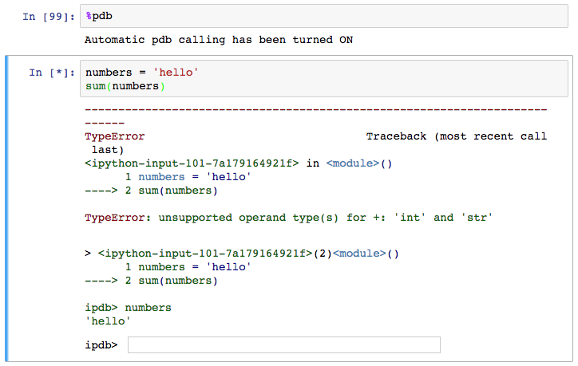

## show help function
shfit+tab for brief doc

twice for full doc

## timing

If you want to time how long it takes for a whole cell to run, you’d use %%timeit at the beginning of the cell.


Timing how quickly your code runs is essential for this optimization. You can use the %timeit magic command to time how long it takes for a function to run.


## visualizations

* To render figures directly in the notebook, you should use the inline backend with the command %matplotlib inline.
* On higher resolution screens such as Retina displays, the default images in notebooks can look blurry. Use %config InlineBackend.figure_format = 'retina' after %matplotlib inline to render higher resolution images.


## debugging
With the Python kernel, you can turn on the interactive debugger using the magic command %pdb. When you cause an error, you'll be able to inspect the variables in the current namespace.



There are a whole bunch of other magic commands, I just touched on a few of the ones you'll use the most often. To learn more about them, here's the list of all available [magic commands](http://ipython.readthedocs.io/en/stable/interactive/magics.html).


## converting notebooks
you can use **nbconvert**
```bash
jupyter nbconvert --to html notebook.ipynb
```

## creating a slideshow
Create slideshows from notebooks is one of my favorite features. You can see [an example of a slideshow](http://nbviewer.jupyter.org/format/slides/github/jorisvandenbossche/2015-PyDataParis/blob/master/pandas_introduction.ipynb#/) here introducing Pandas for working with data.


 


The slides are created in notebooks like normal, but you'll need to designate which cells are slides and the type of slide the cell will be. In the menu bar, click View > Cell Toolbar > Slideshow to bring up the slide cell menu on each cell.

```bash
 jupyter nbconvert notebook.ipynb --to slides
```
to see it immediately
```bash
jupyter nbconvert notebook.ipynb --to slides --post serve
```
