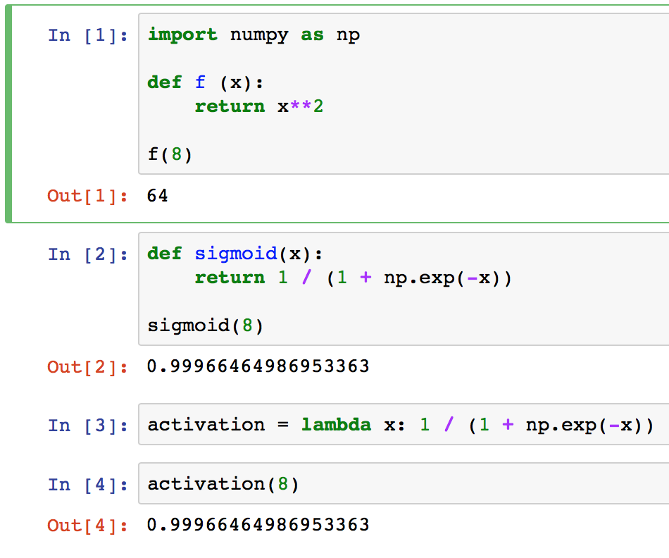

### zip
use zip and compaction to compute dot product of two vectors
```python
wx = sum(a * b for a , b in zip(x,w))
```

## lambda function
http://www.secnetix.de/olli/Python/lambda_functions.hawk



## global scope of a variable inside a function
```python
def update_input_layer(review):
    
    global layer_0
    
    # clear out previous state, reset the layer to be all 0s
    layer_0 *= 0
    for word in review.split(" "):
        layer_0[0][word2index[word]] += 1

update_input_layer(reviews[0])
```

### extended slices
https://docs.python.org/2.3/whatsnew/section-slices.html
```python
>>> L = range(10)
>>> L[::2]
[0, 2, 4, 6, 8]

>>> L[::-1]
[9, 8, 7, 6, 5, 4, 3, 2, 1, 0]

>>> s='abcd'
>>> s[::2]
'ac'
>>> s[::-1]
'dcba'
```

a[x:y:z] is gives the same result as a[slice(x, y, z)]. 
```python
>>> range(10).__getitem__(slice(0, 5, 2))
[0, 2, 4]

>>> range(10)[slice(0, 5, 2)]
[0, 2, 4]
```

## mini-batch
```python
import math
def batches(batch_size, features, labels):
    """
    Create batches of features and labels
    :param batch_size: The batch size
    :param features: List of features
    :param labels: List of labels
    :return: Batches of (Features, Labels)
    """
    assert len(features) == len(labels)
    # TODO: Implement batching
    outout_batches = []
    
    sample_size = len(features)
    for start_i in range(0, sample_size, batch_size):
        end_i = start_i + batch_size
        batch = [features[start_i:end_i], labels[start_i:end_i]]
        outout_batches.append(batch)
        
    return outout_batches
```
